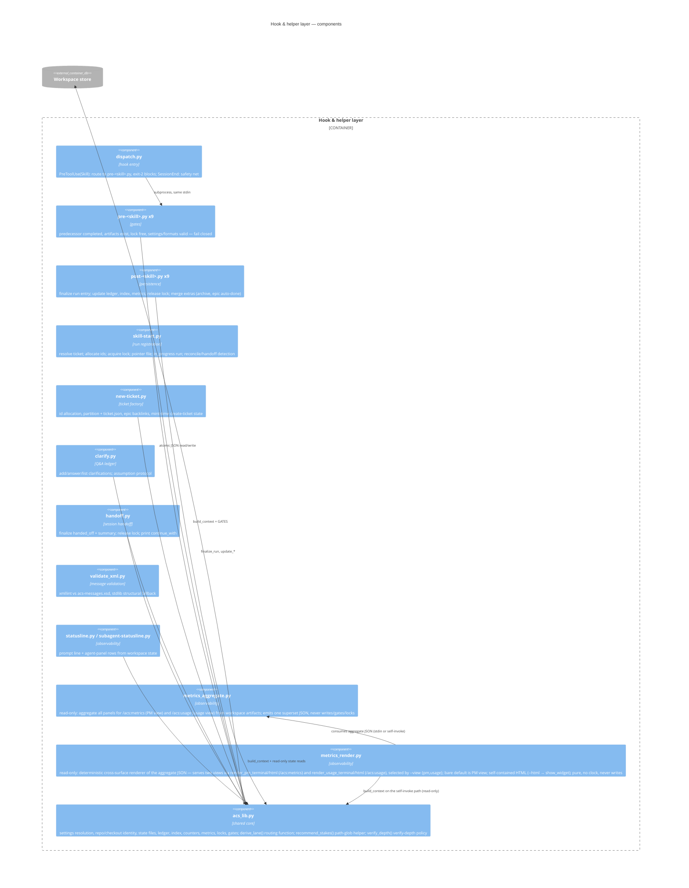

# C4 Level 3 — Components (hook & helper layer)

The container with the most internal structure is the deterministic layer.
(C4 level 4 — code — is deliberately out of scope; `acs_lib.py` and its tests
serve that level.)

## Skill-side anatomy (per hooked skill)

Every coordinator follows the same protocol components (defined once in
`plugins/acs/docs/INTERNALS.md`): Start (skill-start) → Resume/reconcile →
Reflection loop (XML tasks → phase artifacts → validation → persistence) →
User interaction (clarification ledger) → Context pressure (handoff) →
Finish (result document → post-hook → completion report).
