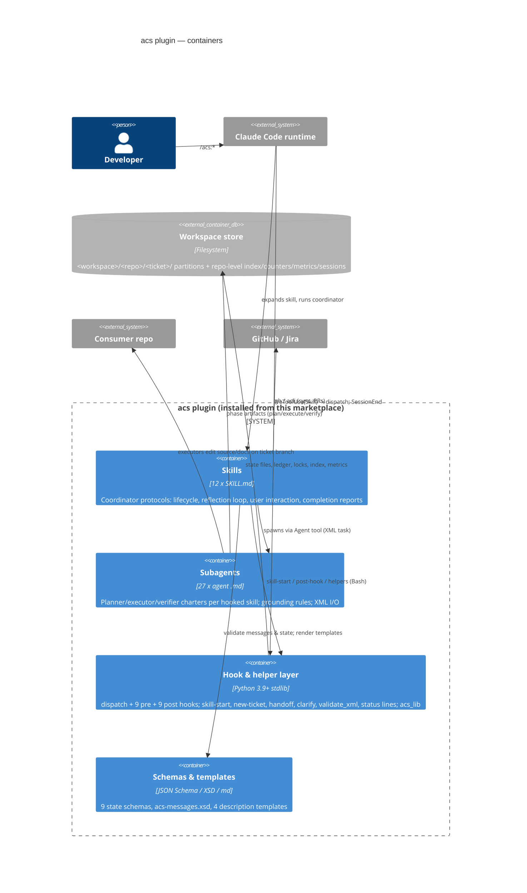

# C4 Level 2 — Containers

Container responsibilities are deliberately asymmetric: **skills/agents decide,
the hook layer records and gates** — no prose can unlock a gate, and no script
makes a judgment call.
