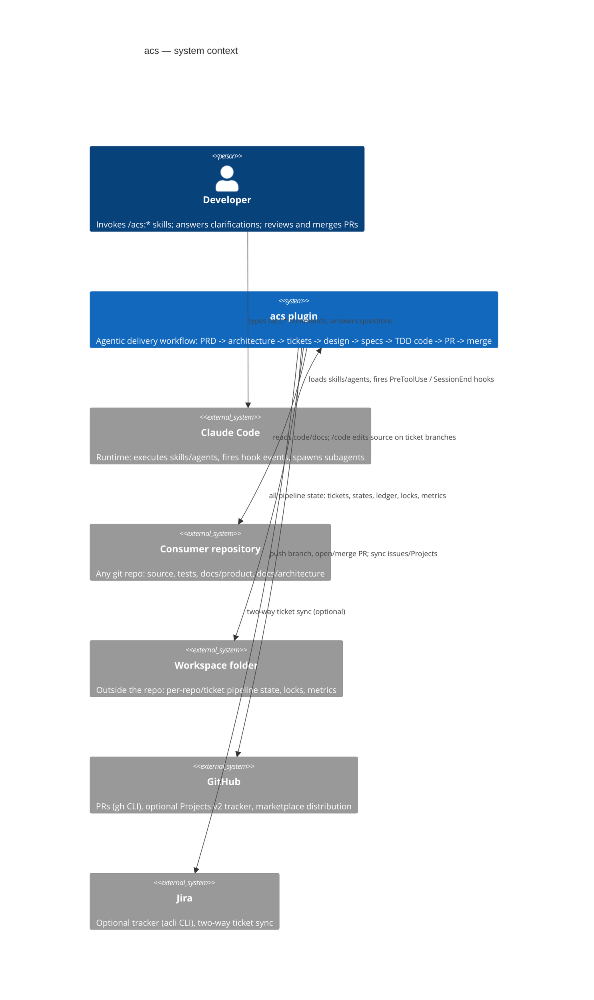

# C4 Level 1 — System Context

Trust boundaries: the plugin never stores credentials — `gh` and `acli` own
authentication. The workspace is machine-local; cross-machine handoff is out
of scope (see PRD).
