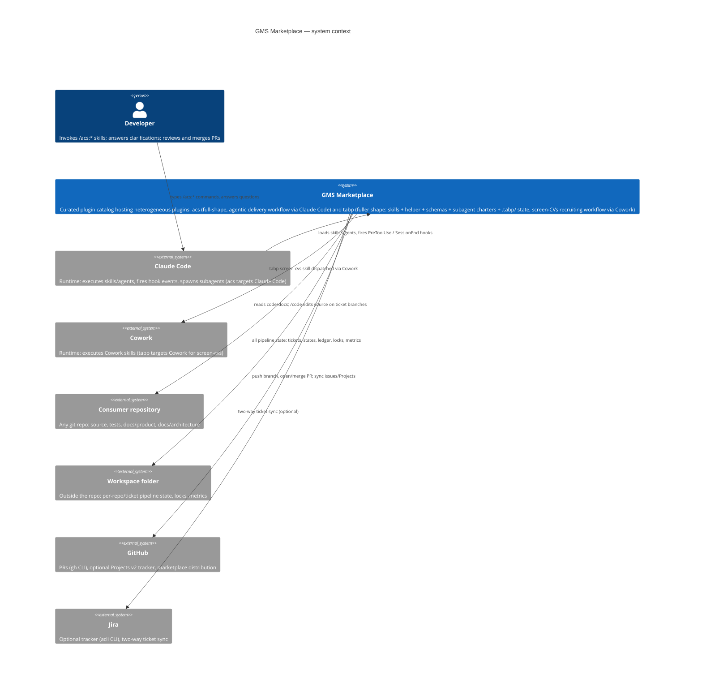

# C4 Level 1 — System Context

Trust boundaries: the marketplace plugins never store credentials — `gh` and
`acli` own authentication. The workspace is machine-local; cross-machine
handoff is out of scope (see PRD).
