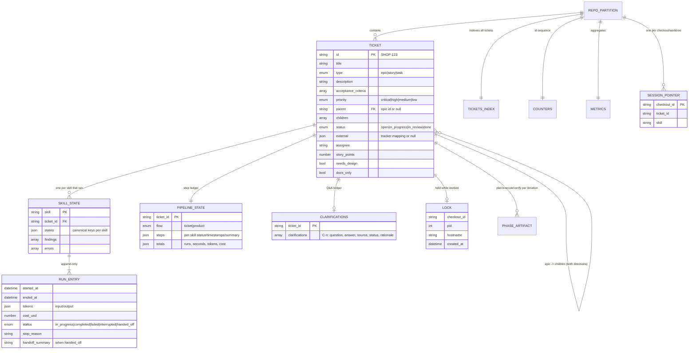

# HLD — Data model (workspace state)

All entities are JSON files under `<workspace>/<repo-id>/`; schemas ship with
the plugin (`plugins/acs/schemas/`). Pretty-printed, atomically written,
human-auditable.

Invariants (enforced by `acs_lib` + schemas + tests):

- `runs[-1]` is the only source of current status — nothing mirrored at top level.
- Epic ↔ child links stored in **both** directions; epic status auto-managed.
- Cross-partition writes limited to the defined parent-epic updates; reads
  (e.g. a child consuming the epic's `design.md`) are allowed.
- Done partitions move to `archive/` — never deleted; the index keeps them.
