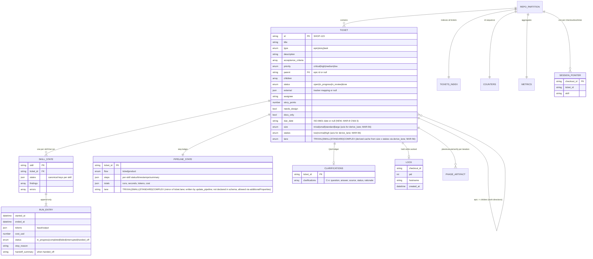
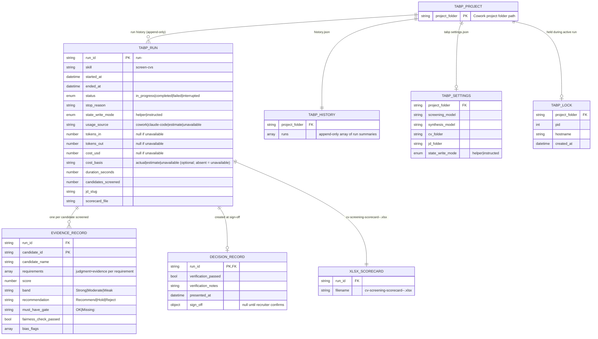

# HLD — Data model (workspace state)

All entities are JSON files under `<workspace>/<repo-id>/`; schemas ship with
the plugin (`plugins/acs/schemas/`). Pretty-printed, atomically written,
human-auditable.

Invariants (enforced by `acs_lib` + schemas + tests):

- `runs[-1]` is the only source of current status — nothing mirrored at top level.
- Epic ↔ child links stored in **both** directions; epic status auto-managed.
- Cross-partition writes limited to the defined parent-epic updates; reads
  (e.g. a child consuming the epic's `design.md`) are allowed.
- Done partitions move to `archive/` — never deleted; the index keeps them.

---

## tabp plugin data model

Source: `MAR-2/specs/01-tabp-state-json-schemas.md`, `MAR-1/design.md:652-722`.
Schemas: `plugins/tabp/schemas/`. All entities live in `<project>/.tabp/`
within the Cowork project folder (separate from the acs workspace partition).

Invariants (enforced by `tabp_helper.py` at runtime, not by schema alone):

- `runs[-1]` in `history.json` is the current status of the most recent run.
- `status = "in_progress"` means the run is resumable from `.tabp/runs/<run-id>/`.
- Evidence records and the decision record are appended/updated only within an `in_progress` run.
- The lock is held while `status = "in_progress"`; stale locks are reported, not stolen.
- No entry in `history.json` or any per-run file is ever deleted; archives are never purged.

PII-minimal rule: `candidate_name` holds only a name or anonymised label. No contact
details, no protected-class attributes, no secrets in any state file
(`design.md:129-132`).
