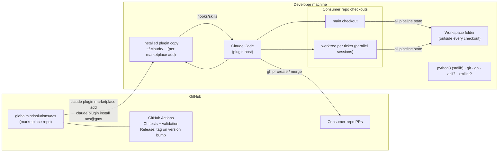

# HLD — Deployment & runtime topology

Key facts:

- **Distribution**: GitHub URL only; semver in `plugin.json`; the release
  workflow tags `v<version>` when the version bumps on `main` (updates reach
  users only on version bumps).
- **One workspace, many repos**: `workspace_path` is machine-local
  (`settings.local.json`, gitignored) and may serve any number of consumer
  repos — partitions are keyed by repo identity derived from the git remote,
  so every worktree of a repo shares one partition.
- **No server-side anything**: the plugin is files; all execution happens in
  the user's Claude Code session and shell. Tracker/PR access goes through
  the user's authenticated CLIs.
- **This repo's own CI** runs the deterministic-layer suite (Python 3.9 +
  3.12), JSON/schema validation, and the prose contract tests on every PR.
