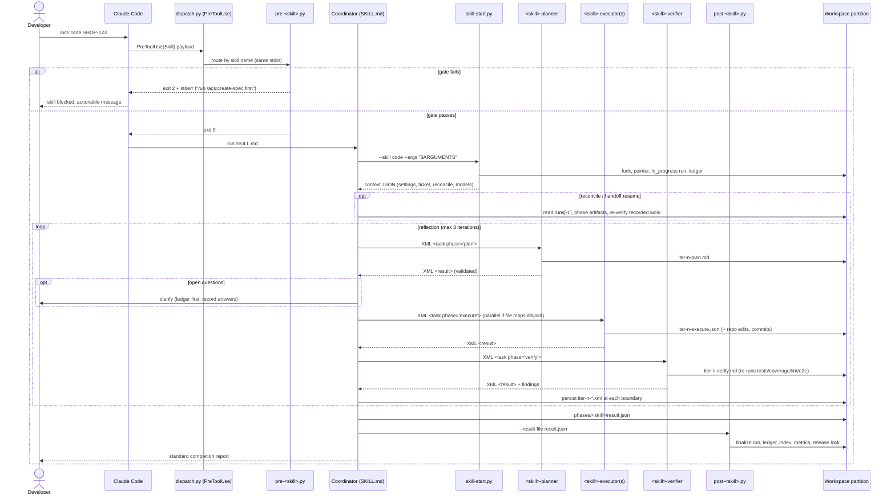

# Flow — Hook-gated skill run

The core runtime flow: every hooked skill, direct invocation. (Under `/ship`
the coordinator invokes the same flow directly — see `ship-pipeline.md`.)



Failure shapes: iteration cap → `failed` with findings recorded; coverage
hard-fail → `failed`, `/create-pr` gate stays closed; crash → `in_progress`
left behind, SessionEnd marks `interrupted`, next run reconciles.

## Codex CLI variant (MAR-5)

The `PreToolUse` event is replaced by the **no-bypass shim**: the first instruction in the
Codex skill definition (`plugins/acs/runtimes/codex/skills/<skill>.md`) calls
`dispatch.py pre` before any coordinator prose runs (D1 Option B, ADR-0035).

The shim synthesizes a Claude-Code-shaped stdin payload and pipes it to `dispatch.py pre`:
```
echo '{"cwd":"'"$PWD"'","tool_input":{"skill":"acs:<skill>"}}' | \
    python3 "$ACS_PLUGIN_ROOT/hooks/scripts/dispatch.py" pre
```

Exit 2 → coordinator body unreachable (AC-1).  Exit 0 → coordinator proceeds.  The
`dispatch.py` routing logic (`dispatch.py:25-75`) and `acs_lib` gates (`acs_lib.py:1443-1462`)
are reused byte-for-byte unchanged (AC-2).

The Codex `Stop` event maps to `dispatch.py session-end` (same path as the Claude Code
`SessionEnd` hook), finalizing `interrupted` runs and releasing the ticket lock.

The reflection loop uses serial `--ephemeral` sessions for each phase (see MAR-3
design.md Sequence diagram 1 and 2; implemented in MAR-6).

## Verify-depth scaling (MAR-58 / D4)

The iteration ceiling for the reflection loop is **lane-driven**:

- **TRIVIAL/SMALL lanes** (low/normal stakes): cap = **1** iteration — light
  verify (single verifier pass that may iterate once on blocking findings).
- **STANDARD/COMPLEX lanes** (or any high-stakes ticket): cap = **3** iterations
  — full verify (existing plan→execute→verify loop + full 11-dimension review
  + e2e when configured), unchanged.

The ceiling is determined by `verify_depth(ticket.lane, ticket.stakes)` in
`acs_lib.py` (see `VERIFY_ITERATION_CAP`). High-stakes tickets ALWAYS use full
verify regardless of size (stakes floor; AC-2).

**The verifier subagent runs in every lane as the in-loop gate (C-5).** Light
verify reduces the iteration ceiling only — the verifier always runs; there is
no inline human-approval gate. The TDD/coverage gate (Coverage hard fail) is
never trimmed by the verify-depth selection and applies in full in every lane.
