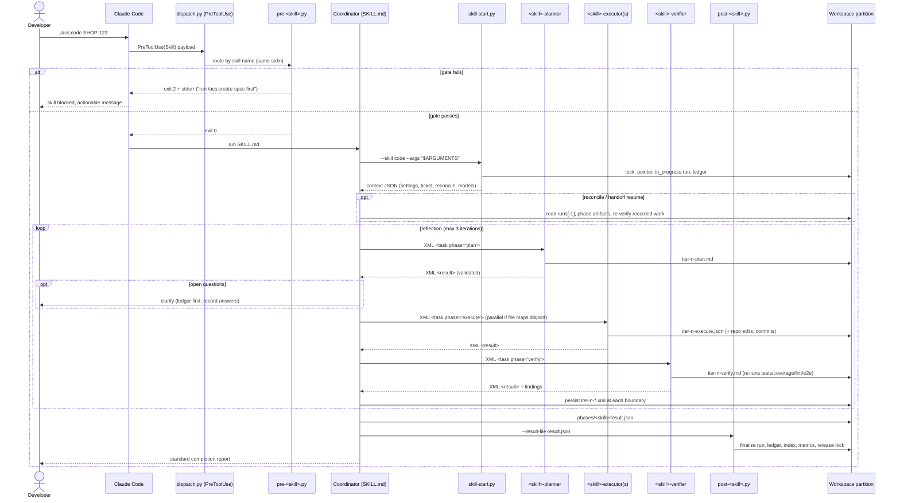

# Flow — Hook-gated skill run

The core runtime flow: every hooked skill, direct invocation. (Under `/ship`
the coordinator invokes the same flow directly — see `ship-pipeline.md`.)

The diagram below shows the **full reflection triad** (planner → executor →
verifier), which is how the six triad-keeping skills run (`create-prd`,
`create-architecture`, `create-project`, `create-design`, `create-spec`,
`code` — `/acs:code` is the example traced here). The three **apply-work
skills** (`create-ticket`, `create-pr`, `merge-pr`) run **inline** instead
(MAR-60): the coordinator performs the steps directly or delegates to **at most
one executor**, with **no planner and no verifier subagent** in any lane —
their correctness is gated upstream by `/code`'s verifier (`create-pr`,
`merge-pr`) or by the schema plus the user-confirmation gate (`create-ticket`).

Failure shapes: iteration cap → `failed` with findings recorded; coverage
hard-fail → `failed`, `/create-pr` gate stays closed; crash → `in_progress`
left behind, SessionEnd marks `interrupted`, next run reconciles.

## Verify-depth scaling (MAR-58 / D4)

The iteration ceiling for the reflection loop is **lane-driven**:

- **TRIVIAL/SMALL lanes** (low/normal stakes): cap = **1** iteration — light
  verify (single verifier pass that may iterate once on blocking findings).
- **STANDARD/COMPLEX lanes** (or any high-stakes ticket): cap = **3** iterations
  — full verify (existing plan→execute→verify loop + full 11-dimension review
  + e2e when configured), unchanged.

The ceiling is determined by `verify_depth(ticket.lane, ticket.stakes)` in
`acs_lib.py` (see `VERIFY_ITERATION_CAP`). High-stakes tickets ALWAYS use full
verify regardless of size (stakes floor; AC-2).

This initial ceiling is the **starting** value only. At the start of each
iteration `/code` runs the in-loop **upward escalation check** (MAR-57): on a
verifier finding signaling higher stakes/size, a `recommend_stakes` glob match
firing `"high"`, or an explicit user/agent request, `guard_axes` clamps each
axis upward and `escalate_lane` recomputes the lane via `derive_lane`; the
ceiling is then raised to `max(current, new)` — **monotone, never lowered**.
Completed iterations are preserved (no restart). De-escalation is never
automatic. If escalation crosses the fast→full fold boundary (TRIVIAL/SMALL →
STANDARD/COMPLEX) the `create-spec` stage is re-introduced — `/code` spawns the
full `create-spec` triad per its "Escalation pickup" protocol before resuming.

**The verifier subagent runs in every lane as the in-loop gate (C-5).** Light
verify reduces the iteration ceiling only — the verifier always runs; there is
no inline human-approval gate. The TDD/coverage gate (Coverage hard fail) is
never trimmed by the verify-depth selection and applies in full in every lane.
