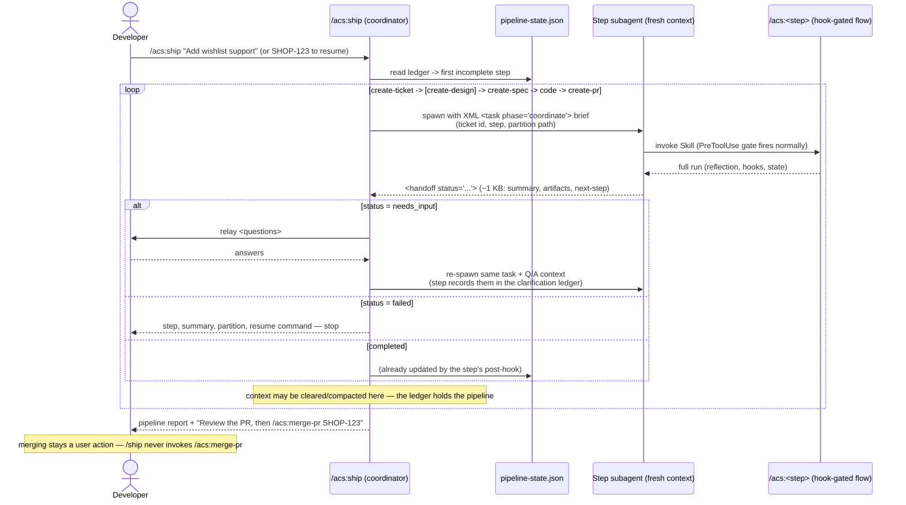

# Flow — /ship pipeline orchestration

`/ship` adds orchestration only: every step runs the hook-gated flow inside a
fresh subagent context, returning a compact `<handoff>`; the ledger
(`pipeline-state.json`) is the only memory `/ship` needs.

Properties: every hook gate still fires inside the step subagent (no bypass);
re-running `/ship <ticket>` resumes from the ledger; epic fan-out runs each
child's pipeline independently (parallel worktrees supported).
