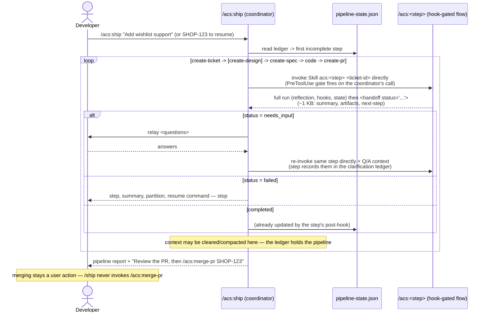

# Flow — /ship pipeline orchestration

`/ship` adds orchestration only: the coordinator invokes each step's hook-gated
flow **directly** via the Skill tool in its own context, reading a compact
`<handoff>` back; the ledger (`pipeline-state.json`) is the only memory `/ship`
needs.

Properties: every hook gate still fires on the coordinator's direct Skill call
(no bypass); re-running `/ship <ticket>` resumes from the ledger; epic fan-out
runs each child's pipeline independently (parallel worktrees supported).
