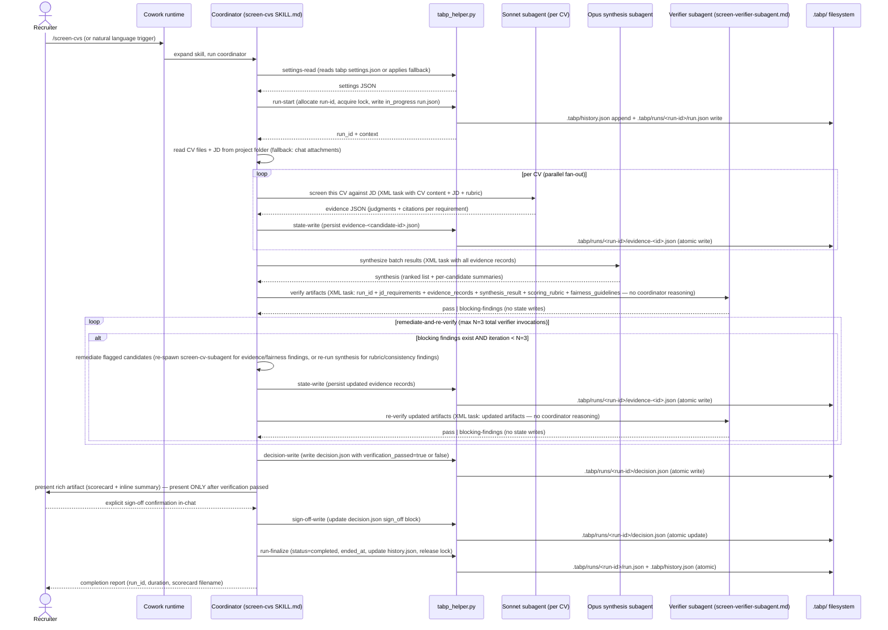

# Flow 1 — tabp Screening + State Write

This flow documents the end-to-end sequence for a `screen-cvs` run, from recruiter
invocation through evidence persistence and result delivery. It corresponds to
`design.md` Flow 1 (`design.md:736-778`) and is implemented by the coordinator
instructions in `plugins/tabp/skills/screen-cvs/SKILL.md`.

Cross-references to SKILL.md steps:
- **Step 0** — Initialise the tabp run (`settings-read`, `run-start`, degradation path).
- **Step 3a** — Fan out Sonnet subagents, persist evidence, invoke Opus synthesis.
- **Step 5a** — Independent verification (verifier subagent, always-on, N=3 cap, present only after pass).

## Sequence diagram

## Step-by-step annotations

### Step 0 — Initialise the tabp run

The coordinator reads `tabp settings.json` via `settings-read` (or applies
documented fallbacks), then calls `run-start` to allocate a `run_id`, acquire
the `.tabp/` spin-lock, and write an `in_progress` record to
`.tabp/runs/<run-id>/run.json`. The `run_id` is carried through all subsequent
helper calls in this run.

This corresponds to **Step 0** in `plugins/tabp/skills/screen-cvs/SKILL.md`.

### Step 3a — Fan out and persist evidence

After gathering inputs (Steps 1-2) and running the manual per-CV evaluation
(Step 3), the coordinator fans out one Sonnet subagent per candidate CV in
parallel. Each subagent follows the charter in
`plugins/tabp/agents/screen-cv-subagent.md` and returns a source-grounded
evidence record. The coordinator persists each record via `state-write`
(atomic write to `.tabp/runs/<run-id>/evidence-<id>.json`) as it arrives.

After all Sonnet subagents complete, the coordinator spawns one Opus synthesis
subagent (charter: `plugins/tabp/agents/synthesis-subagent.md`) that applies
the scoring rubric and returns a ranked batch result.

This corresponds to **Step 3a** in `plugins/tabp/skills/screen-cvs/SKILL.md`.

### Step 5a — Independent verification (AC-3 gate)

Before presenting any results, the coordinator spawns an independent verifier
subagent (charter: `plugins/tabp/agents/screen-verifier-subagent.md`). The
verifier is passed exactly six inline artifacts — `run_id`, `jd_requirements`,
`evidence_records`, `synthesis_result`, `scoring_rubric`, and
`fairness_guidelines` — and no coordinator reasoning or framing. The verifier
operates in isolation from the coordinator's perspective.

The verifier re-checks five dimensions:

- Evidence citations are non-empty and specific.
- Fairness guardrails were applied uniformly.
- Must-have gates are consistent with recommendation values.
- The scoring rubric was applied with identical thresholds for all candidates.
- Cross-candidate consistency holds.

The verifier returns a `pass` or `blocking` verdict with per-finding detail.

**Remediate-and-re-verify loop (capped at N=3 total verifier invocations):**
If the verdict is `blocking`, the coordinator remediates the flagged issues
(re-spawning affected `screen-cv-subagent` instances for evidence/fairness
findings, or re-running the synthesis subagent for rubric/consistency findings),
persists any updated records via `state-write`, and re-spawns the verifier. The
loop is capped at N=3 total verifier invocations. If the third invocation still
returns `blocking`, the loop exits and the coordinator writes
`verification_passed=false` with the unresolved blocking findings in
`verification_notes`, then notifies the recruiter without delivering Step 6
results.

Results are presented **only** after the verifier returns a clean `pass`. The
verifier runs on every `screen-cvs` run with no skip path (always-on).

This corresponds to **Step 5a** in `plugins/tabp/skills/screen-cvs/SKILL.md`.

## Degradation path

**When Cowork denies Bash access (C-5):** all `CO->>TH` steps become `CO->>FS`
direct coordinator writes (Option A behavior). The coordinator writes
`state_write_mode: "instructed"` into `run.json` at Step 0 to record the
degraded mode. The subagent fan-out (Step 3a) and independent verification
(Step 5a) are unaffected — only the persistence mechanism changes. Atomic
write and spin-lock guarantees are lost in degraded mode; this is acknowledged
in `run.json`.

Source: `design.md:780-782`.
