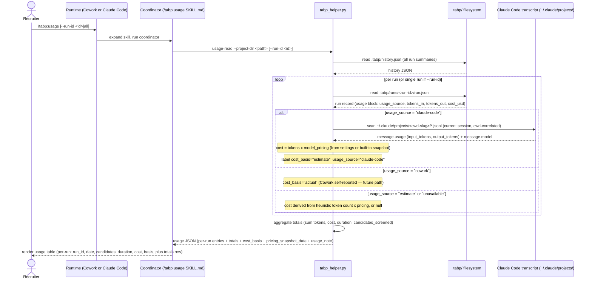

# LLD Flow — /tabp:usage read

Sequence diagram for the `/tabp:usage` read flow. The skill reads aggregated
cost, time, and token data from the `.tabp/` run history and renders per-run
and totals to the recruiter. This is a purely read path: no writes, no
re-screening, no network calls.

## Sequence diagram



No writes. No re-screening. No network calls.

## Step annotations

### Step 1 — Coordinator invokes usage-read

The coordinator calls:

```
python3 plugins/tabp/helpers/tabp_helper.py usage-read \
  --project-dir <path> \
  [--run-id <id>]
```

When `--run-id` is omitted, all runs in the project are aggregated. The helper
reads `.tabp/history.json` to enumerate runs, then reads each
`.tabp/runs/<run-id>/run.json` for usage details.

### Step 2 — Per-run source dispatch and cost_basis labeling

For each run, the helper dispatches based on `usage_source`:

- **`claude-code`** — scans the Claude Code transcript (`.jsonl` files in
  `~/.claude/projects/<cwd-slug>/`) for token counts correlated to this run.
  Derives cost by multiplying tokens by the model pricing snapshot. Labels
  `cost_basis="estimate"` because the cost is derived, not billed.
- **`cowork`** — uses Cowork self-reported usage. Labels `cost_basis="actual"`.
  (Future path; not yet live in MAR-39 scope.)
- **`estimate`** — token count derived from heuristics; cost derived from
  pricing snapshot. Labels `cost_basis="estimate"`.
- **`unavailable`** — usage data cannot be read for this run. Returns
  `tokens_in=null`, `tokens_out=null`, `cost_usd=null`,
  `cost_basis="unavailable"`.

### Step 3 — Aggregate totals computation

The helper aggregates across all processed runs:

- `total_duration_seconds` — sum including unavailable runs (duration is
  available even when token/cost data is not).
- `total_tokens_in`, `total_tokens_out`, `total_cost_usd` — sum **excluding**
  unavailable runs (`tabp_helper.py:1072-1077`).
- Aggregate `cost_basis` — `"actual"` if any run has actual data; `"estimate"`
  if any run is an estimate; `"unavailable"` if all runs are unavailable.
- `pricing_snapshot_date` — the date of the pricing table snapshot used for
  all estimate derivations.
- `usage_note` — a human-readable note explaining that cost is a derived
  estimate and unavailable runs are excluded from totals.

### Step 4 — Coordinator renders to recruiter

The coordinator renders:

1. A Markdown table with one row per run (columns: run_id, date, status,
   candidates, duration_seconds, tokens_in, tokens_out, cost_usd, cost_basis,
   usage_source). Null values rendered as "—".
2. A Totals summary block with aggregate figures and the `pricing_snapshot_date`.
3. The `usage_note` verbatim below the totals.
4. Any cost with `cost_basis="estimate"` is labeled as an estimate, never
   presented as an actual charge.
