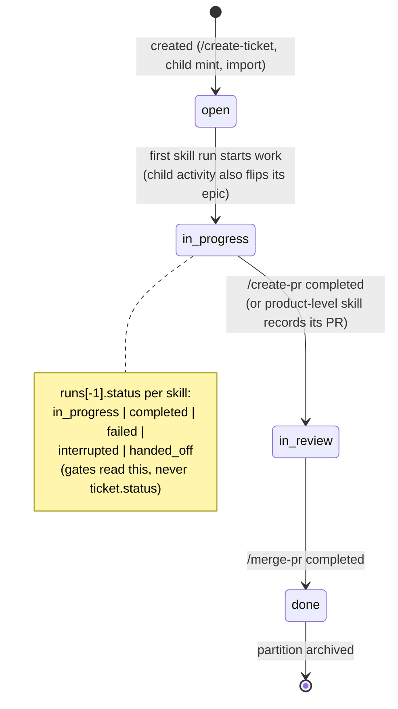

# Flow — Ticket lifecycle & merge

## Status lifecycle



## Merge & archive sequence

```mermaid
sequenceDiagram
    actor Dev as Developer (after own PR review)
    participant CO as /acs:merge-pr coordinator
    participant GH as GitHub (gh CLI)
    participant POST as post-merge-pr.py
    participant WS as Workspace

    Dev->>CO: /acs:merge-pr SHOP-123
    CO->>GH: readiness: CI status, approvals, conflicts, protections
    alt not ready
        CO-->>Dev: report-only — what blocks, no auto-fix
    else ready
        CO->>GH: merge (configured strategy, default squash); delete branch
        CO->>CO: clean worktree if one was used; tracker sync to Done
        CO->>POST: result document
        POST->>WS: ticket done; epic auto-done when last child;<br/>clear pointers; metrics (pr merged)
        POST->>WS: move partition -> archive/SHOP-123/
        CO-->>Dev: completion report (cleanup performed, archive path)
    end
```

Epic auto-management: **In Progress** on first child activity (skill-start),
**Done** when the last child merges (post-merge-pr checks siblings via the
index) — both performed by the deterministic layer, not prose.
