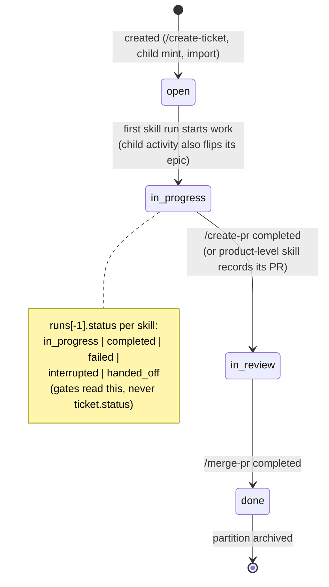
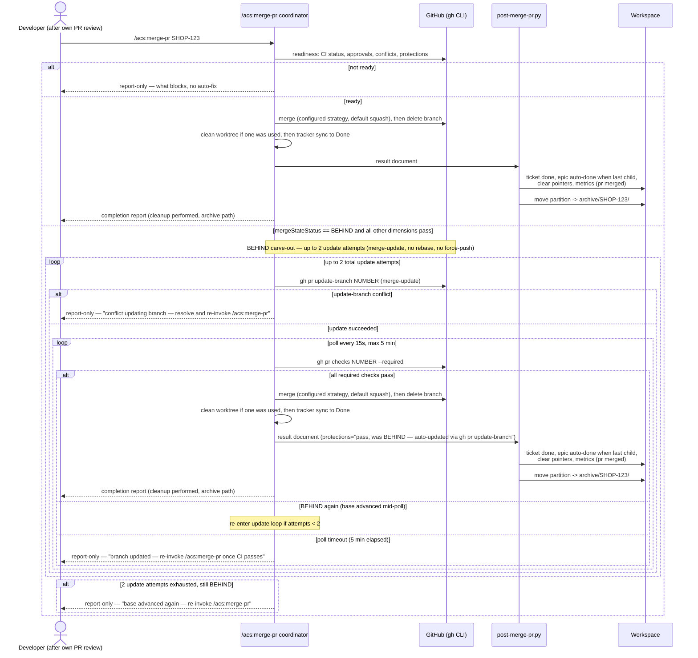

# Flow — Ticket lifecycle & merge

## Status lifecycle

## Merge & archive sequence

Epic auto-management: **In Progress** on first child activity (skill-start),
**Done** when the last child merges (post-merge-pr checks siblings via the
index) — both performed by the deterministic layer, not prose.

## Ticket classification fields

Every ticket carries three classification fields written at mint time and re-confirmed
at create-ticket (MAR-56):

- **`size`** — authoritative size axis, one of `trivial` | `small` | `standard` | `large`.
  Default `standard` when absent. Set during `/create-ticket` analysis, user-confirmed.

- **`stakes`** — authoritative stakes axis, one of `low` | `normal` | `high`.
  Default `normal` when absent. Set during `/create-ticket` analysis, user-confirmed.
  A path-glob match against `high_stakes_paths` in settings RECOMMENDS stakes=high;
  the user confirms or overrides.

- **`lane`** — derived cache: `derive_lane(size, stakes, needs_design, type)` maps the two
  authoritative axes to one of `TRIVIAL` | `SMALL` | `STANDARD` | `COMPLEX`. The lane is
  never accepted verbatim from user input; it is always recomputed from the axes at write
  time to keep the cache consistent. `lane` is mirrored into `pipeline-state.json` and
  `tickets-index.json` so the metrics layer can slice by lane (G14/G15).

Conservative default: absent axes resolve to `size=standard`, `stakes=normal`, `lane=STANDARD`
(full verification rigor — never a fast lane when inputs are unknown).
