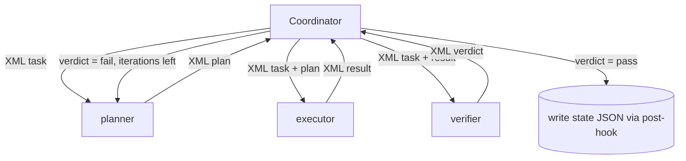

# Reflection & Subagent Architecture

## Coordinator–subagents pattern

The workflow is built on a **coordinator–subagents** architecture:

- For each skill invocation, a **coordinator** (the main agent running the
  skill) orchestrates dedicated **subagents**.
- The coordinator performs **dynamic decomposition**: it breaks the skill's
  work into subagent tasks based on the actual ticket/specs at hand (e.g. one
  executor task per spec), rather than a fixed, hard-coded task list.
- The coordinator MUST NOT keep conversation history between workflow steps.
  Everything a later step needs is read from JSON files in the workspace
  (see [workspace-and-state.md](workspace-and-state.md)).

## Reflection pattern: plan → execute → verify

The six **triad-keeping skills** (create-spec, code, create-prd, create-design,
create-architecture, create-project) MUST apply the Reflection pattern as a
**plan–execute–verify cycle**, with a **different subagent for each phase**.
Each phase runs in a separate context window so the verify phase judges the work
fresh rather than rubber-stamping its own output. The table below shows the three
phases and their responsibilities for a representative triad-running skill:

| Phase | Subagent (example for `/code`) | Responsibility |
|-------|--------------------------------|----------------|
| Plan | `code-planner` | Analyze inputs (workspace state, repo, docs, config); produce a concrete plan for the executor. |
| Execute | `code-executor` | Carry out the plan; produce the skill's artifacts (ticket, design, specs, code, PR, merge). |
| Verify | `code-verifier` | Independently check the executor's output against the plan and the skill's quality bar; report pass/fail with findings. |

### Apply-work skills: inline shape (MAR-55 invariant (b))

The **apply-work** group — `/acs:create-pr`, `/acs:merge-pr`, and
`/acs:create-ticket` — does **not** apply the Reflection pattern. These skills
are inline and deterministic: the coordinator handles the work directly,
optionally delegating to at most one executor subagent. No plan-phase subagent
and no verify-phase subagent are spawned — this holds in every lane. Upstream
quality is gated by the code-verifier (before the PR is opened or merged) or by
the user-confirmation gate (at ticket creation); there is no in-skill verify
phase for these three skills.

Requirements:

- The three phases MUST be separate subagents (separate context windows), so
  the verifier judges the work fresh rather than rubber-stamping its own
  output.
- On verification failure, the cycle reflects: the coordinator feeds the
  verifier's findings back into another plan/execute iteration.
  - The cycle runs at most **lane-driven iterations**:
    - **TRIVIAL/SMALL lanes** (low/normal stakes): at most **1 iteration** (light
      verify — single verifier pass that may iterate once on blocking findings;
      cap = `VERIFY_ITERATION_CAP["light"]` = 1).
    - **STANDARD/COMPLEX lanes**, or any **high-stakes** ticket: at most
      **3 iterations** (full verify — existing plan→execute→verify loop + full
      11-dimension review + e2e when configured, unchanged; cap =
      `VERIFY_ITERATION_CAP["full"]` = 3).
    - When `ticket.lane` or `ticket.stakes` are absent or unrecognized, default
      conservatively to full (3-iteration ceiling).
    - On hitting the lane's cap with findings remaining, the skill stops and
      records its findings and stop reason in its state file.

  **Absolute invariants — apply in every lane regardless of verify depth:**

  - The **verifier subagent is the in-loop quality gate in every lane** (C-5).
    Light verify differs from full only in iteration ceiling; the verifier always
    runs. There is no inline human-approval gate; the human-in-the-loop
    checkpoint is the PR review before merge.
  - The **TDD/coverage gate runs in full in every lane and is never trimmed by
    verify-depth selection** (invariant a, MAR-55). Depth selection is not a
    verify dimension that light mode drops.

  **Mid-flight ceiling raise on escalation (MAR-57).** The lane-driven ceiling
  stated above is the *initial* ceiling, computed at the start of the `/code`
  run. If an in-flight escalation trigger fires mid-run (verifier finding of
  higher stakes/size, a `high_stakes_paths` glob match on a touched file, or an
  explicit user/agent request), the coordinator recomputes the ceiling via
  `VERIFY_ITERATION_CAP[verify_depth(new_lane, new_stakes)]` and raises the
  in-flight ceiling **monotonically** — it is never lowered. A ticket that
  starts at a TRIVIAL/SMALL ceiling (1 iteration) and escalates to
  STANDARD/COMPLEX (3 iterations) immediately acquires the full 3-iteration
  ceiling for all remaining iterations. The absolute invariants above (verifier
  always runs in every lane; TDD/coverage gate immutable in every lane) hold
  regardless of any in-flight ceiling change.

- Subagent naming convention: `<skill>-planner`, `<skill>-executor`,
  `<skill>-verifier`. 27 agent files exist on disk in total and are retained
  (C-4) — three role files for each of nine skill prefixes that have agent
  files. Only the **six** triad-keeping skills listed in the heading above
  actively spawn the full plan→execute→verify triad. The other three prefixes
  belong to the **apply-work** skills, which run inline and never spawn a
  plan-phase or verify-phase subagent (see the "Apply-work skills" subsection
  below).
- For the **apply-work** group, only the executor-suffix agent file may be
  delegated to at most once per invocation; the plan-phase and verify-phase
  agent files are retained on disk but the coordinator no longer spawns them.
  See the "Apply-work skills" subsection above for the full inline shape.
- Each role's **model and reasoning effort are user-configurable** in
  `settings.json` (`models.planner` / `executor` / `verifier`, with
  per-skill overrides); unset values inherit the parent context's model and
  effort ([configuration.md](configuration.md#subagent-models)).

> **Note:** the `code-verifier` carries the broadest verification scope: in
> addition to spec conformance, tests, and coverage, it reviews the whole
> changeset (business logic, features, quality, technical standards,
> architecture, system design, security, documentation). There is no
> separate review skill — see [skills.md](skills.md).
>
> **Verifier anchoring**: a verifier judges the work against the **gated
> upstream contracts** (specs, ticket, design), never against the
> same-iteration plan — an unverified plan must not be able to certify the
> work it shaped. The plan's contribution to verification is its **verifier
> checklist** section only (a floor, never a ceiling), and verifiers never
> read executor reasoning — only artifacts.



## Coordinator ↔ subagent communication: XML

- All communication between the coordinator and subagents MUST use a defined
  **XML format** — both task assignments (coordinator → subagent) and results
  (subagent → coordinator).
- Messages MUST be **validated against a formal schema (XSD)** shipped with
  the plugin, so malformed messages fail fast instead of silently degrading
  the pipeline.
- The format SHOULD carry, at minimum: ticket id, skill, phase, task
  description, references to workspace input files, and (on the way back)
  status, findings, error details, and output file references.

**[ASSUMPTION]** Illustrative shape — the concrete schema is to be defined
during design:

```xml
<task skill="code" phase="execute" ticket-id="SHOP-123">
  <objective>Implement spec 02-api-endpoints</objective>
  <inputs>
    <file>specs/02-api-endpoints.md</file>
    <file>plan.json</file>
  </inputs>
  <constraints>
    <tdd>true</tdd>
    <coverage-target>90</coverage-target>
  </constraints>
</task>

<result skill="code" phase="execute" ticket-id="SHOP-123" status="completed">
  <outputs>
    <file>code-progress.json</file>
  </outputs>
  <findings>…</findings>
  <errors>…</errors>
  <stop-reason>…</stop-reason>
</result>
```

## File-based state instead of conversation memory

- Subagents MUST write their **states, findings, error details, and stop
  reasons** into JSON files in the workspace folder. Concretely, every phase
  writes its own artifact into `<partition>/phases/<skill>/`: the planner
  `iter-<n>-plan.md` (the complete plan), each executor
  `iter-<n>-execute[-<k>].json` (artifacts produced, repo files changed,
  commands run with outcomes), the verifier `iter-<n>-verify.md` (every check
  with evidence, every finding in detail). XML results reference these files,
  never inline their bodies.
- **Grounding**: every subagent decision, claim, and finding MUST be traceable
  to a source read or run in that task — cited file/section next to the
  statement, or the quoted command and output. A missing input is an error,
  not a guess; an unverifiable point is an explicit assumption with rationale;
  verifiers treat ungrounded plans/reports as blocking findings.
- Native **plan mode is not used** for the reflection plan phase: planners are
  spawned subagents with no user to approve a plan, and resumability comes
  from the phase artifacts plus gates. The planner's read-only discipline is
  enforced by its tool allowlist (planners/verifiers: read tools + Write
  solely for their own phase artifact; executors additionally may not spawn
  agents or invoke skills).
- The coordinator MUST persist each phase's output (plan, executor results,
  verifier verdict) to the ticket partition **at the phase boundary**,
  before starting the next phase — a context loss or crash never loses more
  than the in-flight phase
  ([workflow.md](workflow.md#resuming-a-ticket)).
- The coordinator reads these files to decide the next action; it never
  depends on having seen earlier messages.
- This makes every step **resumable** (a crashed or interrupted skill can be
  re-run and continue from recorded state) and **inspectable** (the user can
  audit any step's reasoning trail in the workspace).

## Decomposition & concurrency rules

- Decomposition is **exclusively the coordinator's job**: planner, executor,
  and verifier subagents MUST NOT spawn their own sub-subagents. This keeps
  the state files and the XML message flow predictable.
- The coordinator MAY run **multiple executors in parallel** within one
  skill (e.g. one executor per spec in `/code`), provided their outputs do
  not conflict; the verifier runs after all parallel executors complete and
  judges the combined result.
- The exact XSD is defined during design; the XML shapes in this document
  are illustrative.
