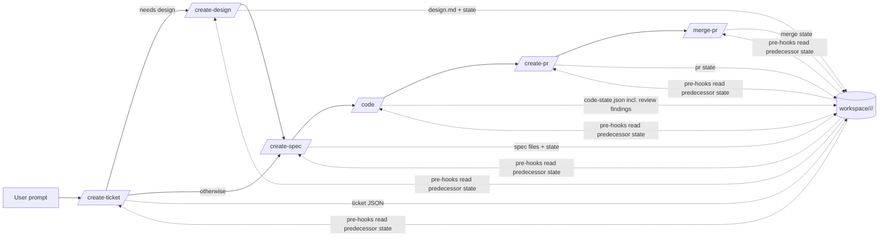

# End-to-End Workflow

## Pipeline

The `acs` plugin implements a multi-step delivery workflow. The six workflow
skills MUST run in the following order for a given ticket (`/create-design`
is conditional — see below):

| # | Skill | Purpose (summary) |
|---|-------|-------------------|
| 1 | `/create-ticket` | Analyze & clarify requirements from the user prompt, codebase, and docs; create a ticket of type **epic**, **story**, or **task**. |
| 2 | `/create-design` | *(conditional — when the ticket needs design)* Analyze the ticket, codebase, and docs; evaluate options with trade-offs and produce an approved design (`design.md`): decision & rationale, architecture, contracts, risks, rollout. |
| 3 | `/create-spec` | Analyze & clarify the ticket (and the design, when one exists); produce one or more implementation specs that conform to it. |
| 4 | `/code` | Analyze & clarify the specs; implement features / bug fixes / tasks using the **TDD pattern**, updating affected repo docs as part of the change. Its verifier also reviews the changeset for business logic, features, quality, technical standards, architecture, system design, security, and documentation — see [Review feedback loop](#review-feedback-loop). |
| 5 | `/create-pr` | Create a pull request shipping the implementation. |
| 6 | `/merge-pr` | Review PR readiness and merge it if possible; when the readiness check fails, it is **report-only** (no automatic fixes). **User-invoked only**, after the user has reviewed the PR themselves — never auto-triggered by the pipeline. |

`/create-design` runs only for tickets flagged **`needs_design: true`** —
always set for **epics**, and set for stories/tasks during `/create-ticket`
analysis (planner recommendation, confirmed with the user). Child tickets of
an epic do **not** repeat design: their `/create-spec` consumes the parent
epic's `design.md`.

## Step gating

- Each workflow skill MUST be guarded by a **pre-hook** that checks readiness
  before the skill runs. Readiness means, at minimum: the predecessor skill's
  state file exists in `<workspace>/<repo>/<ticket-id>/` and reports **completed**.
  The conditional design step branches the chain: `/create-spec`'s
  predecessor is `/create-design` when the ticket (or its parent epic) needs
  design, otherwise `/create-ticket`; `/create-design`'s own gate
  additionally requires `needs_design: true`.
- If the predecessor is not complete, the pre-hook MUST exit with code **2**,
  which blocks the skill from running, and SHOULD emit a clear message telling
  the user which skill to run first.
  - Example: `pre-code.py` checks that specs exist and `/create-spec` is
    completed; if not, it exits 2 and `/code` does not run.
- Each workflow skill MUST be followed by a **post-hook** that writes the
  skill's own state into a JSON state file in the workspace
  (e.g. `post-code.py` writes `code-state.json`).

See [hooks.md](hooks.md) for hook details and
[workspace-and-state.md](workspace-and-state.md) for state file
requirements.

## Umbrella command: `/ship`

`/ship <prompt>` drives the pipeline end-to-end: it MUST run
`/create-ticket` → `/create-design` (when the ticket needs design) →
`/create-spec` → `/code` → `/create-pr` in sequence, pausing for user
clarifications wherever a skill requires them, and MUST **stop before
`/merge-pr`** — merging stays a user action.

- Every hook gate still applies: `/ship` adds orchestration only and MUST NOT
  bypass pre/post hooks.
- SHOULD be resumable: re-running `/ship` for a ticket continues from the
  first incomplete step recorded in the workspace state.
- `/ship` has no planner/executor/verifier of its own; each invoked skill
  runs its own reflection cycle.

### Context handoff between steps

`/ship` MUST keep its own context window small — a full pipeline cannot fit
every skill's transcript in one context:

- The `/ship` coordinator **invokes each step skill directly in its own
  context** (it holds the Agent tool the step needs to spawn its own
  planner/executor/verifier). Between steps it reads only `pipeline-state.json`,
  `ticket.json`, and the step's `<handoff>` / `result.json` — never the step's
  transcript — so its own context stays small.
- A step returns only a **compact XML handoff result** (status, stop reason,
  artifact references — bounded to roughly a kilobyte); full detail lives in
  the workspace state files.
- Post-hooks maintain **`pipeline-state.json`** in the ticket partition — a
  small step ledger (per-step status, timestamps, handoff summaries). `/ship`
  reads this single file to pick the next step or resume, so its context can
  be **cleared or compacted at any step boundary** without losing the
  pipeline.

## Ticket context

Every workflow skill except `/create-ticket` operates on an existing ticket
and therefore MUST resolve a `<ticket-id>` before doing anything. Resolution
order:

1. **Explicit argument** — the user passes a ticket id when invoking the
   skill (e.g. `/code SHOP-123`). Always wins.
2. **Session context** — the ticket id is detected from the conversation
   history of the current session (e.g. the ticket was just created or
   discussed there).
3. **Branch name** — the ticket id is parsed from the current git branch
   name, which embeds it by convention (see formats in
   [configuration.md](configuration.md)).

If no ticket id can be resolved, the skill MUST stop and ask the user.

Note: pre/post **hooks** are deterministic scripts and cannot interpret
conversation history — they resolve the ticket id from the **per-checkout
pointer file** written by the coordinator at skill start
(`<workspace>/<repo>/sessions/<checkout-id>.json`), falling back to the
branch name. See [hooks.md](hooks.md) and
[workspace-and-state.md](workspace-and-state.md).

## Epic fan-out

When `/create-ticket` creates an **epic**, it MUST suggest creating child
**story**/**task** tickets for it. Each child ticket:

- gets its own `<ticket-id>` and its own workspace partition;
- runs its own pipeline (`/create-spec` → … → `/merge-pr`) independently —
  enabling parallel work on children of the same epic.

The epic itself is a grouping/tracking ticket; implementation happens on the
children. The epic's status MUST be auto-managed:

- **In Progress** — as soon as work starts on any child;
- **Done** — when all of its children are merged.

Child hooks perform the parent updates: the first workflow skill run on a
child marks the epic In Progress; the last child's `post-merge-pr` marks it
Done.

## Inside each step: Reflection

Every skill MUST internally run a **plan → execute → verify** cycle using a
dedicated subagent per phase (e.g. `code-planner`, `code-executor`,
`code-verifier`). The coordinator orchestrates these subagents and
communicates with them in XML. Details in
[reflection.md](reflection.md).

## Review feedback loop

Changeset review happens **inside `/code`**, performed by the
`code-verifier` — there is no separate review skill. The loop is
**automatic**:

- The `code-verifier` checks spec conformance, tests, and coverage, **and**
  reviews the whole changeset for business logic, features, quality,
  technical standards, architecture, system design, security, and
  documentation (affected docs updated and consistent with the code).
- When the verifier produces blocking findings, the coordinator MUST
  automatically run another remediation iteration: re-plan, re-execute (TDD
  still applies), re-verify.
- **All findings block** — there is no severity threshold; the loop runs
  until the verifier reports **zero findings**. When an `e2e` layer is
  configured ([configuration.md](configuration.md)), a **green e2e
  run** is part of the zero-findings bar.
- The loop runs at most **3 iterations**; if findings remain, `/code` stops
  and records the findings and stop reason in `code-state.json`.
- Only when the verifier passes does the `/create-pr` pre-hook gate open.
- Every iteration is recorded in the workspace state files (findings, fixes,
  stop reasons), so the loop is resumable and auditable like everything else.

## Statelessness between steps

The coordinator MUST NOT need conversation history to move from one step to
the next. Each step's subagents persist everything a later step needs —
states, findings, error details, stop reasons — as JSON files under
`<workspace>/<repo>/<ticket-id>/`. A user MUST be able to run each skill in a fresh
session (or a different worktree) and have the pipeline pick up where it left
off.

## Resuming a ticket

Resume works at three levels, all from workspace state alone:

1. **Between steps** — `pipeline-state.json` and the per-skill state files
   record what is complete; pre-hook gates point at the next step. Running
   the next skill in any fresh session continues the pipeline.
2. **Within `/ship`** — re-running `/ship` for a ticket reads
   `pipeline-state.json` and continues from the first incomplete step
   ([Context handoff](#context-handoff-between-steps)).
3. **Mid-skill** — a run entry is appended with status **`in_progress`** by
   the coordinator at skill start and finalized by the post-hook, and the
   coordinator persists every phase output (plan, executor results, verifier
   verdicts) to the partition at each phase boundary. Even a hard crash that
   skips the post-hook therefore leaves evidence: `runs[-1].status ==
   "in_progress"` plus a stale `.lock` — downstream gates read "not
   completed". On re-run, the coordinator enters **reconcile mode**: verify
   which recorded work actually holds (e.g. re-run tests for specs marked
   implemented), then continue from the first unfinished phase. A crash can
   lose at most the in-flight phase.

The `.lock` file is **re-entrant for the same checkout**: resuming from the
same worktree reclaims its own lock; only other sessions are blocked.

## Session handoff

A long session can deliberately hand a ticket off to a fresh session — a
handoff is a *planned* resume, so it can do better than crash recovery:

1. **Flush** — the coordinator persists all in-flight work to the ticket
   partition, including soft context that phase boundaries have not captured
   yet: user clarifications and decisions, partial findings of the current
   phase, discovered gotchas.
2. **Mark** — the current run entry is finalized with status
   **`handed_off`** plus a **handoff summary**: what is done, what is in
   flight, next actions, and any decisions not yet reflected in other files.
3. **Release** — the `.lock` is released, so any session (not only the same
   checkout) can take over.
4. **Take over** — in the new session the user re-runs the same skill (or
   `/ship`); the ticket resolves via argument, pointer file, or branch name.
   The coordinator sees `runs[-1].status == "handed_off"`, reads the handoff
   summary, runs a light reconcile (recorded state is trusted but cheaply
   verified, e.g. by running the tests), and continues.

Triggers: the user invokes the **`/handoff`** utility skill explicitly, and
every workflow skill's coordinator SHOULD perform the same flush proactively
when it detects its context window running low — never burn the last of the
context on work that would be lost with the session.

Scope: handoff targets a new session on the **same machine/workspace**
(`workspace_path` is machine-local). Cross-machine handoff would require a
shared or synced workspace — out of scope for now.

## Parallel work

- The workspace is partitioned by repo, then by `<ticket-id>`
  (`<workspace>/<repo>/<ticket-id>/`), so multiple tickets — across one or
  many consumer repos — can progress independently and in parallel.
- Because the workspace lives **outside** the consumer repo, the same ticket
  pipeline can run inside a dedicated git worktree without state colliding
  with other worktrees.

## Product-level architecture

Tickets flow through the pipeline; the **product architecture doc set** —
bootstrapped by the product-level `/create-architecture` skill
([skills.md](skills.md)) at `architecture_path` in the consumer repo —
is the stable frame around it.

Above the architecture sits the **PRD** (`prd_path`, bootstrapped and
amended by `/create-prd`): vision, goals with success metrics, prioritized
features, and product-level NFRs. The architecture is designed and verified
to satisfy it, and `/create-ticket` traces tickets to its features —
flagging any requested capability that diverges from it.

- **Input**: `/create-ticket` reads the PRD and the architecture doc set
  when analyzing requirements; `/create-design` designs against the doc
  set; a per-ticket design conforms to the documented architecture or
  explicitly states the architecture changes it requires.
- **Output**: `/code` updates the doc set whenever a change alters the
  architecture — both **HLD** (C4 views, data model, deployment) and
  **LLD**, merging the ticket design's new or changed sequence diagrams
  into `lld/flows/`; the `code-verifier`'s documentation dimension checks
  that consistency.
- **Enforcement (docs current by induction)**: the `code-verifier` makes a
  positive, evidenced architectural-impact determination from each diff —
  impact without matching doc changes in the same changeset is a blocking
  finding, and "no impact" is a conclusion, never a default. Drift from
  commits that bypassed the pipeline is repaired **boy-scout style**: design
  and code planners check the touched area's docs against current code and
  schedule stale sections for repair with the ticket; widespread drift
  triggers a recommended `/create-architecture` re-run.

The conformance chain is **PRD → architecture → design → specs → code**,
each level verified against the one above it.

### Living requirements

Per-ticket specs are change-deltas and are archived with their tickets; the
**current** behavioral contract of the product accumulates in the living
requirements doc set (`requirements_path`, default `docs/requirements/`, one
markdown file per feature area):

- **Input**: `/create-ticket` and `/create-spec` read the touched areas'
  requirements files as the current behavior; a request or spec that
  contradicts standing behavior MUST be flagged (deliberate change vs.
  mistake), like a PRD divergence.
- **Output**: `/code`'s documentation step merges the merged ticket's
  acceptance criteria and behavior-defining clarifications (answered/assumed
  ledger entries that define behavior) into the area's requirements file —
  same changeset, same induction as the architecture doc set; the
  `code-verifier`'s documentation dimension blocks a behavioral change whose
  requirements file was not updated.
- The set grows organically from ticket #1 — no bootstrap skill; brownfield
  repos MAY seed area files during `/create-prd`'s baseline analysis.

## Starting a fresh product

For a greenfield product, the product-level skills run before the first
ticket:

1. Create the empty git repo (user) and run **`/init`** (workspace +
   settings).
2. **`/create-prd`** — elicit the product definition from the user: vision,
   problem, personas, goals with success metrics, prioritized features,
   product-level NFRs, constraints; shipped as the PRD doc set.
3. **`/create-architecture`** — design the system to satisfy the PRD;
   produce the full system design (HLD + LLD).
4. **`/create-project`** — scaffold the repo skeleton from that
   architecture: layout, build, **test framework + coverage tooling**,
   linters, CI, and a minimal green vertical slice. Without this, the
   `/code` TDD gates have no harness to run against.
5. **`/create-ticket`** — typically an MVP **epic** derived from the PRD
   roadmap, fanned out into child stories/tasks
   ([Epic fan-out](#epic-fan-out)).
6. **`/ship`** each child through the pipeline; **`/merge-pr`** after your
   own review.

Each product-level step (2–4) creates its own **delivery ticket** and PR
([skills.md](skills.md#product-level-delivery-tickets)), so even the
bootstrap work is tracked in project management — a fresh product's history
starts at ticket #1.

From then on the product is effectively brownfield: the pipeline maintains
the architecture docs as changes land, the PRD is amended via `/create-prd`
re-runs (each amendment a new ticket) when scope grows, and
`/create-project` is never needed again.
